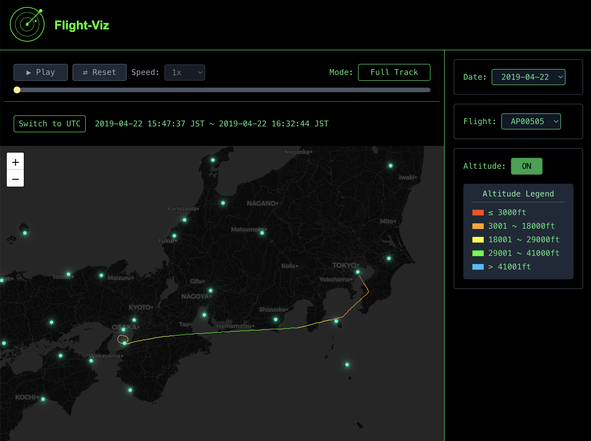
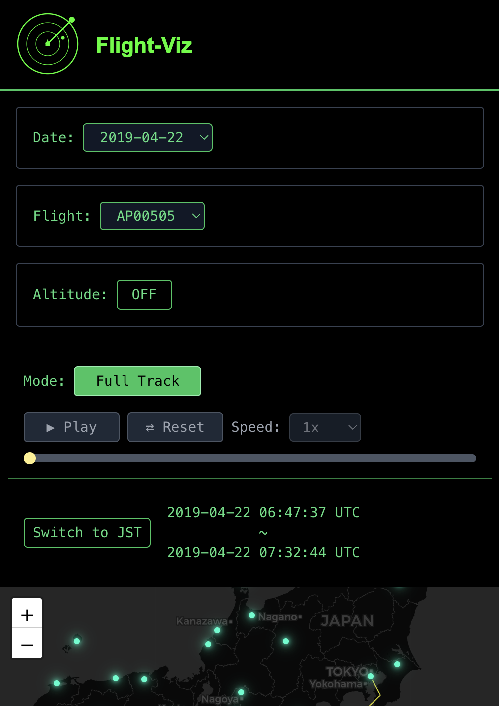
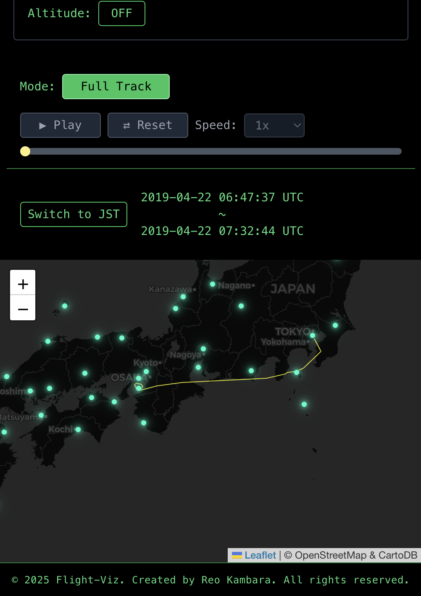
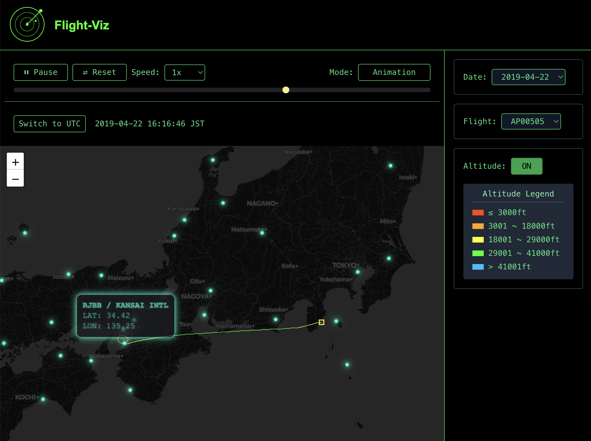
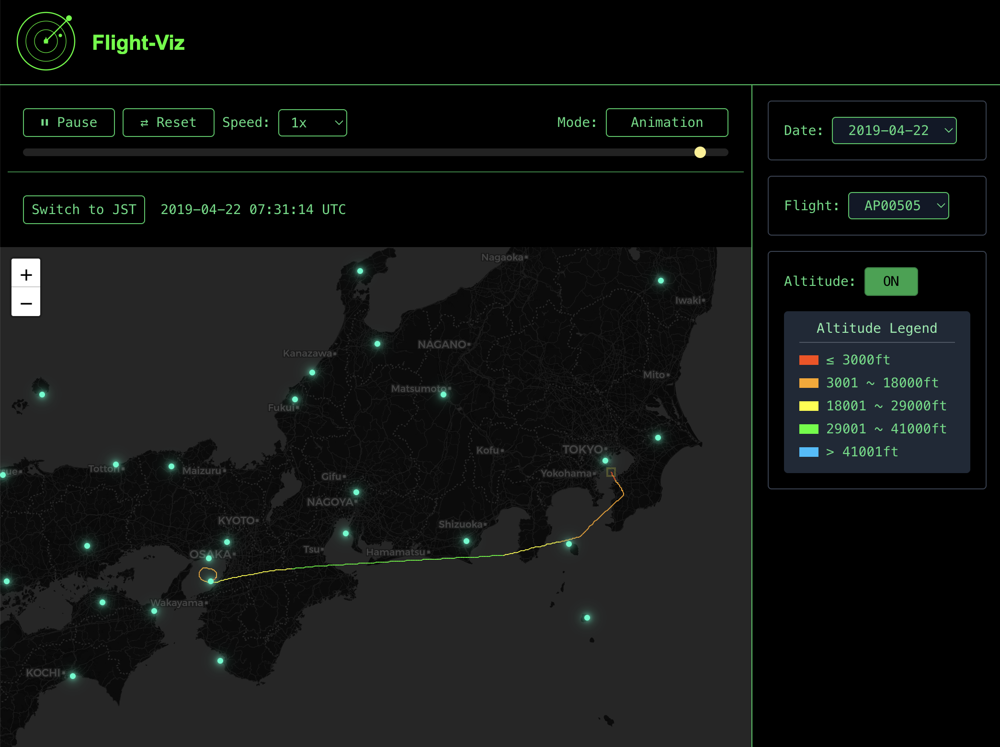

# Flight-Viz — 航跡可視化アプリ

## 概要

**Flight-Viz** は、航空機の飛行経路を可視化・アニメーション表示する Web アプリケーションです。
地図上に航跡を表示し、再生・停止・速度変更などの機能を備え、飛行の様子を直感的に確認できます。

## URL

- https://flightviz.reokambara.com

## このアプリでできること

- 特定のフライトの飛行経路（航跡）表示とアニメーション表示
- アニメーションの一時停止・再開・リセット操作
- アニメーションの再生速度設定
- スライダーによる手動再生位置の変更
- 高度に応じた航跡の色分け表示

## 画面構成

- **アニメーション操作描画領域**

  - アニメーションの一時停止・再開・リセット
  - アニメーションの再生速度変更
  - アニメーションの再生位置変更
  - モード変更（通常表示/アニメーション表示）

- **地図描画領域**

  - 航跡の通常表示/アニメーション表示
  - 時刻表示（JST/UTC）
  - 空港マーカー表示
  - 高度による色分け

- **設定パネル描画領域**
  - 日付選択
  - 便選択
  - 高度表示の ON/OFF

### 通常画面

<p align="left">
  
</p>

### レスポンシブ画面

<div style="display: flex; gap: 4px">
  
  
</div>

## デモ

<p align="left">
  
  
</p>

※ 後日、デモ用 GIF 画像を追加予定（2025/7/6 追加）

<p align="left">
  
</p>

## 環境・主な使用技術

### 環境

- macOS Sonoma 14.5

### フロントエンド

- Node.js 18.20.8
- npm 10.8.2
- TypeScript
- React 19.1.0
- Vite 6.3.5
- Tailwind CSS
- Leaflet.js
- React Router

### バックエンド

- ruby 3.2.8
- Ruby on Rails 7.2.2.1
- PostgreSQL 14.18
- FactoryBot + RSpec

### インフラ

- Docker（開発環境構築）

## ディレクトリ構成

```plaintext
flight-viz/
├── backend/                # Rails API（tracks, flights エンドポイントなど）
│   ├── app/
│   ├── db/
│   ├── lib/data/           # 取り込み対象のCSVファイル配置ディレクトリ
│   ├── spec/
│   └── ...
├── frontend/               # React アプリケーション（Leafletでの可視化）
│   ├── src/
│   │   ├── components/     # 共通UI部品（Map, Selectorなど）
│   │   ├── pages/          # 各画面（Map画面など）
│   │   └── utils/          # APIユーティリティなど
│   └── ...
├── docker-compose.yml      # Dockerコンテナ設定
└── README.md
```

## CSV データについて

### 読み込む CSV ファイル

本アプリでは、飛行データを CSV 形式で取り込み、Rails でデータベースに保存する必要があります。

### データ取り込みのヒント

`backend/lib/data/` 配下に各 CSV データを格納した後、以下の rake タスクでインポート可能です。

```bash
# 飛行データの取り込み
# Import all CSV files under lib/data recursively
docker compose exec backend bundle exec rails tracks:import_all_data

# Import all CSV files under the specified directory in lib/data
ex) docker compose exec backend bundle exec rails tracks:import_dir_data[201904]

# Import specified CSV file under lib/data
ex) docker compose exec backend bundle exec rails tracks:import_file_data[201904/track20190422.csv]

# 空港データの取り込み
# Import Airports CSV file under lib/data
docker compose exec backend bundle exec rails airports:import_file_data[jp-airport.csv]
```

### 必須カラム

#### 飛行データ CSV のフォーマット

| カラム名        | 説明                  | 例         |
| --------------- | --------------------- | ---------- |
| `flight_id`     | フライトの識別子      | EX00001    |
| `timestamp`     | データ記録時刻（UTC） | 18:00:00.0 |
| `lat`           | 緯度                  | 39.133333  |
| `lon`           | 経度                  | 160.783333 |
| `alt`           | 高度（フィート）      | 33000      |
| `aircraft_type` | 型式                  | B748       |

#### 空港データ CSV のフォーマット

| カラム名       | 説明                         | 例                                  |
| -------------- | ---------------------------- | ----------------------------------- |
| `country_code` | 国コード                     | JP                                  |
| `icao_code`    | ICAO 空港コード              | RJAA                                |
| `label`        | 空港名                       | NARITA INTERNATIONAL AIRPORT        |
| `lat`          | 緯度                         | 35.7647                             |
| `lon`          | 経度                         | 140.3864                            |
| `uri`          | データソースの URI           | https://flight-viz.example.com/rjaa |
| `status`       | 地図上への表示有無（0 or 1） | 1                                   |

## ローカル環境起動手順

```bash
# プロジェクトのルートディレクトリに移動

# Docker コンテナをビルド＆起動
docker compose build
docker compose up -d

# データベースのセットアップ
docker compose exec backend bundle exec rails db:create db:migrate

# フロントエンドの依存パッケージをインストール
docker compose exec frontend npm install

# Rails API のRSpecテストを実行（任意）
docker compose exec backend bundle exec rspec
```

## k3s クラスターへのデプロイ

VPS の k3s クラスターに SSL 証明書付きでデプロイできます。

### クイックスタート

```bash
# デプロイ
make deploy

# 状況確認
make status

# ログ確認
make logs-backend
make logs-frontend

# ローカルアクセス
make port-forward  # http://localhost:8080
```

### 主な特徴

- **SSL 証明書自動取得**: cert-manager による Let's Encrypt 証明書の自動取得・更新
- **シンプルな構成**: 理解しやすい Kubernetes マニフェスト
- **コンポーネント分離**: backend/frontend/database の明確な分離
- **セキュリティ**: 非 root 実行、最小権限の原則

詳細なデプロイ手順は [DEPLOY.md](./DEPLOY.md) を参照してください。

## 環境変数設定

本番デプロイ用の環境変数は `k8s/backend/secret.yaml` で管理されています。
必要に応じて以下の値を変更してください：

- PostgreSQL 接続情報
- Rails SECRET_KEY_BASE
- DockerHub 認証情報

## 備考

- ローカル環境: Docker Compose
- 本番環境: k3s + Kubernetes マニフェスト
